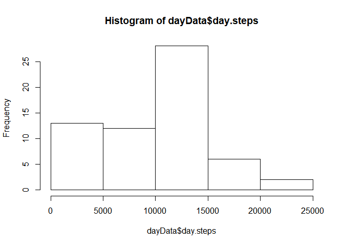
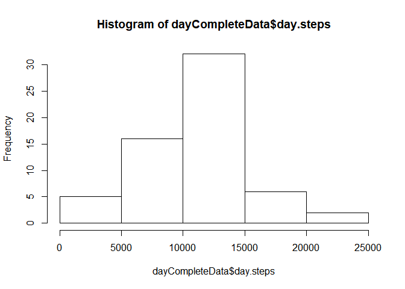

## Loading and preprocessing the data


```r
require(readr)
```

```
## Loading required package: readr
```

```r
myData <- read_csv("activity.zip")
```

```
## Parsed with column specification:
## cols(
##   steps = col_integer(),
##   date = col_date(format = ""),
##   interval = col_integer()
## )
```

## What is mean total number of steps taken per day?

1. Calculate the total number of steps taken per day

```r
require(dplyr)
```

```
## Loading required package: dplyr
```

```
## 
## Attaching package: 'dplyr'
```

```
## The following objects are masked from 'package:stats':
## 
##     filter, lag
```

```
## The following objects are masked from 'package:base':
## 
##     intersect, setdiff, setequal, union
```

```r
dayData <- myData %>%
  group_by(date) %>%
  summarise(day.steps=mean(steps,na.rm=TRUE))
```


1. a histogram of the total number of steps taken each day

```r
hist(dayData$day.steps)
```

<!-- -->

2. the mean total number of steps taken per day

```r
mean(dayData$day.steps, na.rm = TRUE)
```

```
## [1] 37.3826
```

3. the median total number of steps taken per day

```r
median(dayData$day.steps, na.rm = TRUE)
```

```
## [1] 37.37847
```

## What is the average daily activity pattern?

1. Plot of the 5-minute interval (x-axis) and the average number of steps taken, averaged across all days (y-axis)

```r
require(dplyr)
sumData <- myData %>%
  group_by(interval) %>%
  summarise(count=n(), 
            avg.steps=mean(steps,na.rm=TRUE))

plot(sumData$interval, sumData$avg.steps, type="l", xlab= "Interval (mins)", ylab= "Average steps", col="green" , lwd=2)
```

<!-- -->

2. Which 5-minute interval, on average across all the days in the dataset, contains the maximum number of steps?

```r
sumData[which.max(sumData$avg.steps),1]
```

```
## # A tibble: 1 x 1
##   interval
##      <int>
## 1      835
```

## Imputing missing values

1. The total number of missing values in the dataset

```r
require(mice)
```

```
## Loading required package: mice
```

```
## Warning: package 'mice' was built under R version 3.4.4
```

```
## Loading required package: lattice
```

```r
sum(is.na(myData))
```

```
## [1] 2304
```

```r
md.pattern(myData)
```

```
##       date interval steps     
## 15264    1        1     1    0
##  2304    1        1     0    1
##          0        0  2304 2304
```
2. filling in all of the missing values in the dataset using mice package and predictive mean matching method
3. Create a new dataset that is equal to the original dataset but with the missing data filled in.

```r
myData$day <- as.integer(myData$date - as.Date(c("2012-10-01")))
imputedData <- mice(myData[,c(1,3,4)], maxit=1, method = 'pmm', seed = 123)
```

```
## 
##  iter imp variable
##   1   1  steps
##   1   2  steps
##   1   3  steps
##   1   4  steps
##   1   5  steps
```

```r
summary(imputedData)
```

```
## Multiply imputed data set
## Call:
## mice(data = myData[, c(1, 3, 4)], method = "pmm", maxit = 1, 
##     seed = 123)
## Number of multiple imputations:  5
## Missing cells per column:
##    steps interval      day 
##     2304        0        0 
## Imputation methods:
##    steps interval      day 
##    "pmm"    "pmm"    "pmm" 
## VisitSequence:
## steps 
##     1 
## PredictorMatrix:
##          steps interval day
## steps        0        1   1
## interval     0        0   0
## day          0        0   0
## Random generator seed value:  123
```

```r
completeData <- complete(imputedData, 1)
completeData$date <- completeData$day + as.Date(c("2012-10-01"))
```
4. Make a histogram of the total number of steps taken each day and Calculate and report the mean and median total number of steps taken per day

* Calculate the total number of steps taken per day

```r
require(dplyr)
dayCompleteData <- completeData %>%
  group_by(date) %>%
  summarise(day.steps=mean(steps,na.rm=TRUE))
```

* a histogram of the total number of steps taken each day

```r
hist(dayCompleteData$day.steps)
```

<!-- -->

* the mean total number of steps taken per day

```r
mean(dayCompleteData$day.steps, na.rm = TRUE)
```

```
## [1] 36.93306
```

* the median total number of steps taken per day

```r
median(dayCompleteData$day.steps, na.rm = TRUE)
```

```
## [1] 36.70486
```
* Do these values differ from the estimates from the first part of the assignment? What is the impact of imputing missing data on the estimates of the total daily number of steps?

Yes, both mean and median became slightly lower.


## Are there differences in activity patterns between weekdays and weekends?

1. Create a new factor variable in the dataset with two levels - "weekday" and "weekend" indicating whether a given date is a weekday or weekend day.


```r
completeData$weekday <- ifelse(weekdays(completeData$date) %in% c("Saturday", "Sunday"), "weekend", "weekday")
```

2. Make a panel plot containing a time series plot (i.e. type = "l") of the 5-minute interval (x-axis) and the average number of steps taken, averaged across all weekday days or weekend days (y-axis). See the README file in the GitHub repository to see an example of what this plot should look like using simulated data.


```r
sumCompleteData <- completeData %>%
  group_by(interval, weekday) %>%
  summarise(avg.steps=mean(steps,na.rm=TRUE))
library(ggplot2)
ggplot(data=sumCompleteData, aes(x=interval, y=avg.steps, colour = weekday)) +
geom_line(stat="identity") +
facet_wrap(~ weekday, ncol = 1)
```

<!-- -->
